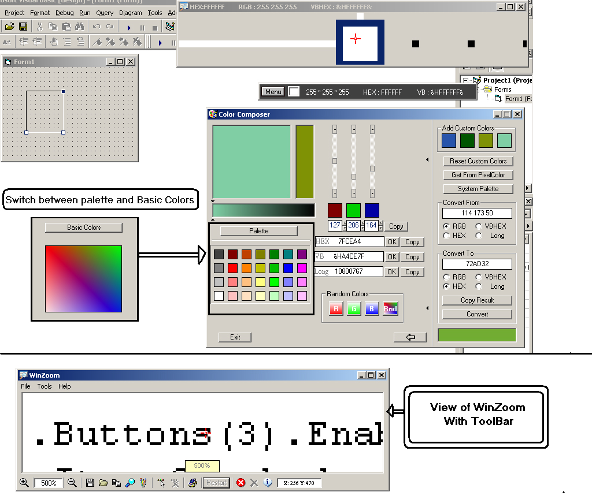



## WinZoom \(Best Windows Magnifing Application\) \*\*\* Must See\*\*\*  Updated Version \- 1\.0\.3

### Description

This application has all the features you would expect from it and more. Some of the main features are

1. You can control the magnification level (From 1x Up to 100x)

2. You can either click any window to freeze the image or disable freeze and have constant zoom(I find it usefull when drawing lines on VB Forms or trying to copy an icon or other small images)

3. You can open a Pixel-Color Toolbar-Like window that lets you choose if you want to view RGB, HEX , or VBHEX (or a combination of any of the three) color, that is currently under the cursor.

4. You can open a Color-Composer Deluxe window, and edit any color you wish.

5. You can also open any image you wish, and have it magnified.

6. WinZoom supports the use of HotKey, to freeze at any time, press and hold Control and F for one second. (The image will freeze even if Freeze is Disabled)

7. You can get rid of toolbar and menus (Click Control - T) to maximize view size.

8. WinZoom remembers all settings, and will use those settings next time its ran.

There is a lot more, check it out!

P.S. Some code was originated from other entries, thought not much. Unfortunetly, I don't remember exactly where it came from. If you see something that looks familiar, please let me know what programs you submitted, and I will give the credit where it belongs.

----

----

1.1 Updated HotKeys, now supports a HotKey for every major function. Please go to Menu-&gt;Help to learn more...

1.2 The new Color-Composer is now on steroids

* I try to make my apps as convinient for me as possible, I am not doing it just to get-it-done, and throw it on PSC, just the opposite. So if you poke around, you will probably find alot of usefull functions and stuff... Thanx.

----

----

Update 3(Update 2 included)

3.1 OnScreen Key Effects. (When Zooming)

3.2 Optional OnScreen Cursor Position(X,Y)

3.3 When ToolBar Disabled, Menu Otions disappear too(See screenshot)

3.4 PopupMenu (Usefull when ToolBar disabled)

3.5 Updated ColorComposer now includes a switch between mini-palette and Basic Colors (See screenshot)

3.6 Better over all interface for Color-Composer.

*Any comments and suggestions are welcome.
 
### More Info
 

             |
---                |---
**Submitted On**   |2006-09-04 20:09:48
**By**             |[Serge\_G](https://github.com/Planet-Source-Code/PSCIndex/blob/master/ByAuthor/serge-g.md)
**Level**          |Intermediate
**User Rating**    |4.9 (34 globes from 7 users)
**Compatibility**  |VB 4\.0 \(32\-bit\), VB 5\.0, VB 6\.0
**Category**       |[Complete Applications](https://github.com/Planet-Source-Code/PSCIndex/blob/master/ByCategory/complete-applications__1-27.md)
**World**          |[Visual Basic](https://github.com/Planet-Source-Code/PSCIndex/blob/master/ByWorld/visual-basic.md)
**Archive File**   |[WinZoom\_\(B201788942006\.zip](https://github.com/Planet-Source-Code/serge-g-winzoom-best-windows-magnifing-application-must-see-updated-version-1-0-3__1-66417/archive/master.zip)

